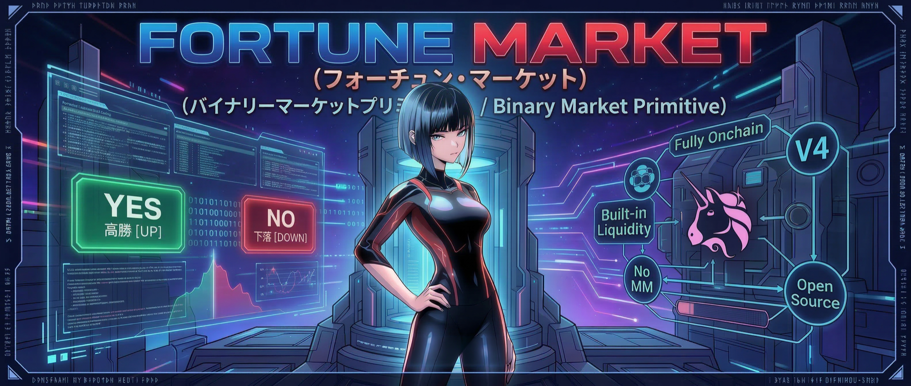
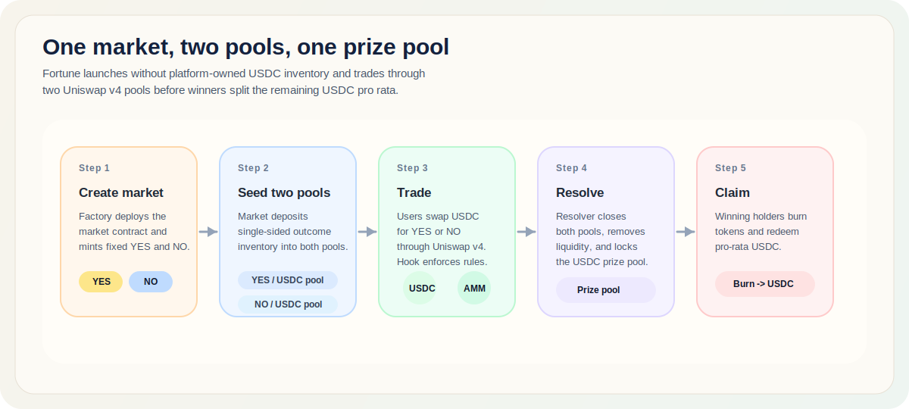
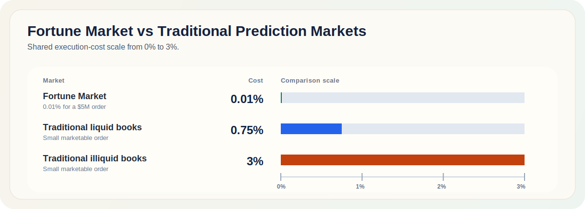
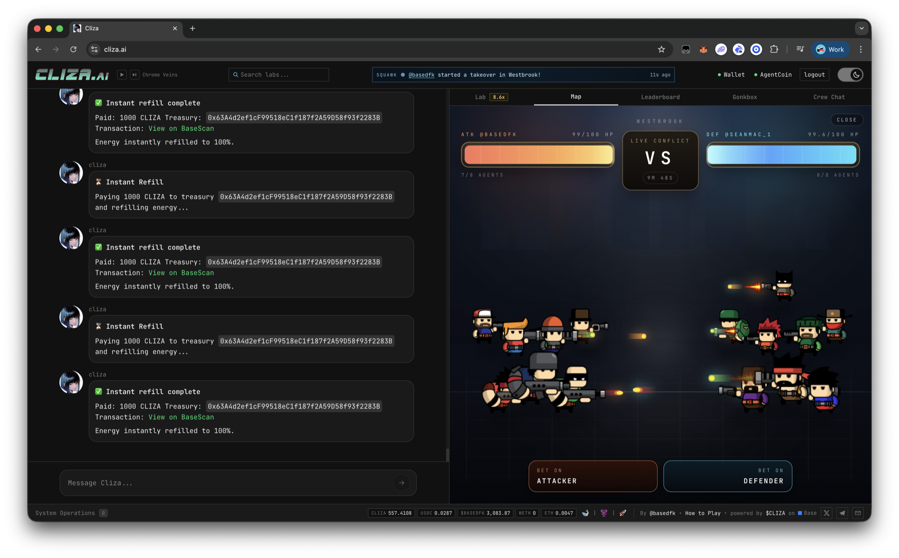

## Quick Start

Using Cursor, Codex or Claude Code?

```bash
git pull https://github.com/ClizaSystems/fortune-market and launch a market
```

<p align="center">
  
</p>

# Fortune Market by Cliza
**Fortune Market is the easiest way to launch onchain prediction markets.** It is a prediction market design built on Base with Uniswap v4.

Technically, this is not a pure pari-mutuel market. It is a fixed-supply binary market with YES and NO ERC20s, two Uniswap v4 pools against USDC, a singleton hook that constrains market behavior, and a resolver that closes both pools and finalizes claims. Settlement is pari-mutuel-like because winning token holders split the remaining USDC prize pool pro rata.

The point is structural: there is no platform-owned liquidity requirement, no standing market maker, and no proprietary matching engine. A market is just contracts, outcome tokens, pools, and resolution.

If the crowd is wrong, winners inherit more of the market's flow. If the crowd is right, Fortune can underperform a traditional fixed-payout market. That is the design bet.

<p align="center">
  <a href="https://star-history.com/#ClizaSystems/fortune-market&Date">
    
  </a>
</p>

## Launch prediction markets like memes

**Turn any idea into a market, then let Uniswap v4 handle pooling, price discovery, and execution.**

1. The factory deploys a per-market contract plus fixed-supply YES and NO ERC20s.
2. Each side gets its own Uniswap v4 pool against USDC, guarded by a singleton hook.
3. The market seeds both pools with single-sided outcome-token liquidity, so launch does not require platform USDC inventory or an external market maker.
4. Traders swap USDC for YES or NO during the open phase.
5. A single designated resolver resolves the outcome. Once resolution is submitted, the market closes both pools, removes liquidity, finalizes the USDC prize pool, and opens claims.
6. Winning token holders burn their tokens to redeem a pro-rata share of the remaining USDC.

<p align="center">
  
</p>

## Zero-liquidity binary market primitive on Uniswap v4

**Say goodbye to platform liquidity, order books and market makers.**

- Outcome tokens are standard ERC20s.
- Price discovery happens in open Uniswap v4 pools.
- Winning-pool USDC fees go entirely to the prize pool.
- Losing-pool USDC fees split 50/50 between the protocol treasury and the prize pool.
- Outcome-token fees are burned.
- The payoff shape is designed to reward being right against flow, not just being right early.

In this repo, the hook is deliberately narrow: only registered market contracts can manage liquidity, ticks are locked to the registered bounds, and swaps are frozen immediately after resolution. The platform does not need to act like a standing market operator just to keep execution working.

That is what makes the system feel closer to launching memes than standing up a full prediction venue.

## Near-zero slippage

**Fortune stays flat at normal trade sizes.** On the current curve, it takes roughly a $5 million trade before curve price impact reaches 0.01%. As a rough benchmark, traditional prediction markets tend to charge about 0.75% slippage in liquid books and about 3% in illiquid books for small marketable orders, with larger trades getting worse as they walk thin top-of-book depth.

<p align="center">
  
</p>

## Payout intuition

**The chart below is generated from the simulator in `lib/payoutScenarios.ts` and rendered by `tools/generate-payout-scenarios-svg.ts`.**

<p align="center">
  
</p>

Fortune tends to lag a traditional fixed-payout market when the crowd is right, outperform when the crowd is wrong, and stay in the same neighborhood when flow is balanced.

## Repository map

**This repo is contract-first.** There is no frontend or indexer here.

- `contracts/FortuneMarket.sol`: market, outcome token, hook, factory, and CREATE2 deployer.
- `lib/marketConstants.ts`: network constants and tick-bound helpers.
- `scripts/deploy.ts` and `scripts/create-market.ts`: deployment and market creation.
- `test/forkLifecycle.ts` and `test/payoutScenarios.ts`: lifecycle and simulator coverage.

## Getting started

**Use the commands below to install dependencies, compile contracts, run tests, and regenerate the payout chart.**

```bash
cp .env.example .env
npm install
npm run compile
npm run test:fast
npm run generate:scenario-svg
```

Only a few environment variables matter for most flows:

```bash
PRIVATE_KEY=0x...
PROTOCOL_TREASURY=0x...
BASE_RPC_URL=https://mainnet.base.org
ETHERSCAN_API_KEY=
FACTORY_ADDRESS=
RESOLVER=0xResolver
MARKET_QUESTION="Will XYZ win ABC?"
MARKET_NOTES="Resolution source, criteria, and any market context."
```

- `npm run test:fast` runs the simulator tests.
- `npm run test:fork` runs the Base fork lifecycle test and requires `BASE_RPC_URL`.
- `npm run deploy` requires `PROTOCOL_TREASURY` and a funded `PRIVATE_KEY`.
- `npm run create:market` requires `FACTORY_ADDRESS` and `MARKET_QUESTION`. `MARKET_NOTES` is optional.

## Deploy flow

**The deployment path is meant to launch binary markets in meme time: one factory deploy, one market creation call, and live pools.**

```bash
npm run deploy
npm run create:market
```

`deploy` mines a CREATE2 salt for the hook permissions and deploys the factory. `create:market` deploys a market, stores the market question plus optional notes onchain, registers both pools, initializes them, and opens trading.

## Audit status

**Fortune Market has been reviewed with:**

- March 19, 2026: [pashov/skills](https://github.com/pashov/skills) using `GPT-5.4`.
- March 19, 2026: [pashov/skills](https://github.com/pashov/skills) using `Claude Opus 4.6 Max`.
- March 19, 2026: [paradigmxyz/evmbench](https://github.com/paradigmxyz/evmbench) using `GPT-5.3 Codex`.
- March 19, 2026: [paradigmxyz/evmbench](https://github.com/paradigmxyz/evmbench) using `GPT-5.4`.
- No confirmed findings came out of the current AI-assisted review passes.
- **No manual audit has been performed. Use at your own risk.**

## Demo

**See Fortune Market live at [cliza.ai](https://cliza.ai) in the Map tab.**

<p align="center">
  
</p>

If there is an active conflict in a district, users can bet on the outcome, the platform resolves the market immediately once the result is known, and winners can claim right away.

<p align="center">
  
</p>
